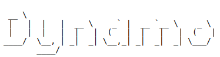

## Introduction
Author: Pham Nguyen Quoc Hung

Descriptions
FreeRTOS Assistant (FA) is my design pattern for using FreeRTOS easily. It creates a virtual bot name Dynamo to post and get event signal to another tasks.

                          
        
## Contact
Author - [PHAM NGUYEN QUOC HUNG](https://hun9pham.github.io) - hungpham99er@gmail.com - [Linkedin](https://www.linkedin.com/in/pham-hung-a12449213/)

